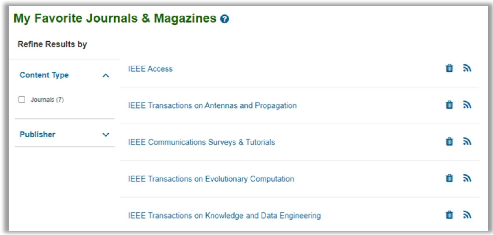
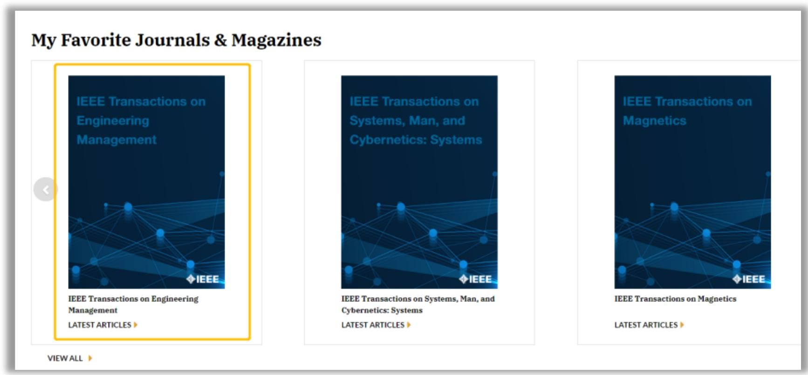

### **Create a Research Project Folder**
::: tip
**HOW TO DO?**
* After logging into your personal account, select My ResearchProjects in the My Settings section of the homepage navigation bar, click to enter the project creation page, and add literature notes and tags.Currently, this function allows the creation of 15 folders, each of which can store 1,000 documents.
* By searching with keywords, click the folder icon on the right side of a specific article page to save it to My Research Projects. Subsequently, you can view the saved articles in My Research Projects under My Settings.
:::

---

### **Save Favorite Journals and Magazines**
* After logging into your personal account, select "Add to My Favorites" on the homepage of the journal you are following.

* On the homepage navigation bar, select My Settings, then My Favorites to manage your saved journals or magazines.

* Thereafter, the collected journals and magazines will be displayed in the My Favorite Journals & Magazines section on the homepage (login to personal account required).

