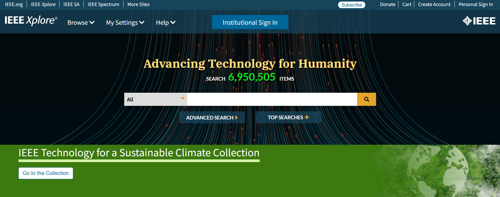

## I. Overview

The **Institute of Electrical and Electronics Engineers (IEEE)** is the world’s largest professional technical organization dedicated to advancing innovation and excellence in ==electrical==, ==electronic==, ==computer==, and ==communication technologies==.
  
The **IEEE Database**, primarily accessed through the **IEEE Xplore Digital Library**, is a comprehensive collection of IEEE’s digital resources. It serves as one of the most authoritative and essential sources of academic and industrial information in the global fields of electrical engineering and computer science. Universities, research institutes, and corporate R&D centers worldwide rely on it as a strategic foundation for technological development.

<LinkCard title="Click to visit IEEE Xplore " href="https://ieeexplore.ieee.org/Xplore/home.jsp" />
## II. Development History

- **Origin (1963):** IEEE was formed through the merger of the *American Institute of Electrical Engineers (AIEE, founded 1884)* and the *Institute of Radio Engineers (IRE, founded 1912)*, establishing a strong foundation in the electrical and electronic domains.  

- **Digitization (1980s–1990s):** With the rise of computer technology, IEEE began digitizing its extensive publication archives, initially distributed via CD-ROMs.  
- **Internet Era (1998):** The launch of the **IEEE Xplore Digital Library** marked a new era of online access, enabling efficient literature search and retrieval.  
- **Continuous Evolution (21st Century–Present):** IEEE Xplore has undergone multiple upgrades, incorporating citation analysis, personalized recommendations, and mobile compatibility. The platform continues to expand its content types—such as eBooks and online courses—aiming to deliver an integrated and user-friendly research experience.

## III. Resource Types and Volume

The IEEE Database is celebrated for the ==**quality**==, ==**diversity**==, and ==**academic rigor**== of its resources.

### 1️⃣ Journals and Magazines
- **Type:** Peer-reviewed academic journals and professional magazines.  
- **Volume:** Over **200** titles, many ranking top in their domains (e.g., *Proceedings of the IEEE*).  
- **Feature:** Represents the **depth** and **systematic nature** of theoretical research.

### 2️⃣ Conference Proceedings
- **Type:** Collections from premier international conferences.  
- **Volume:** Over **1,900** conferences annually, totaling more than **2,000** volumes.  
- **Feature:** IEEE’s hallmark resource—conference papers capture **cutting-edge research** typically **1–2 years ahead** of journal publications.

### 3️⃣ Technical Standards 
- **Type:** Official IEEE standards governing global technologies.  
- **Volume:** Over **5,300** active standards and **1,800** drafts under development.  
- **Feature:** High practical value; many are **cornerstones of modern IT and communication systems**, including:  
  - **IEEE 802.11:** Wi-Fi standard  
  - **IEEE 802.3:** Ethernet standard  
  - **IEEE 754:** Floating-point arithmetic standard  

### 4️⃣ eBooks
- **Type:** Scholarly monographs and textbooks published by IEEE Press or co-published with Wiley and other leading publishers.  
- **Volume:** Over **1,000** titles and steadily increasing.  
- **Feature:** Provides **in-depth**, **comprehensive coverage** of specialized topics.

### 5️⃣ Online Courses (IEEE eLearning Library)
- **Type:** Expert-led professional training modules.  
- **Volume:** Over **400** courses available.  
- **Feature:** Designed for **continuing education** and **professional development**.

::: tip
📈 **Total Volume:** IEEE Xplore now hosts **over 5 million documents**, expanding by **200,000+ new publications each year**.
:::

## IV. Subject Coverage

IEEE’s subject coverage is both deep and broad, encompassing traditional and emerging domains:

### **Core and Classical Disciplines**
- ==Circuits and Systems== 
- ==Communication, Networking, and Broadcasting==  
- ==Components, Packaging, and Manufacturing Technology==  
- ==Computing and Information Processing==  
- ==Electromagnetics and Microwave Technology==  
- ==Electronic Devices==  
- ==Power and Energy Systems==  
- ==Signal Processing==  

### **Emerging and Interdisciplinary Fields**
- ==Artificial Intelligence and Machine Learning== 🤖  
- ==Autonomous Driving== 🚗  
- ==Biomedical Engineering  and Health Informatics== 🧬  
- ==Cloud Computing and Big Data== ☁️  
- ==Cybersecurity== 🔒  
- ==Internet of Things (IoT)== 🌐  
- ==Nanotechnology== ⚛️  
- ==Photonics and Optoelectronics== 💡  
- ==Robotics and Automation== 🤖  
- ==Semiconductor and IC Design== 🧠  
- ==Software Engineering== 💻  
- ==Virtual and Augmented Reality== 🕶️  

## V. Update Frequency

- ==**Daily Updates:**== IEEE Xplore adds new materials almost every day, ensuring timely access to cutting-edge research.  
- ==**Conference Proceedings:**== Typically available within weeks after the corresponding conference concludes.  
- ==**Journals:**== Published on regular cycles (e.g., monthly or bimonthly), with accepted articles often released online ahead of print.  
- ==**Standards:**== Continuously revised and updated in response to technological evolution, with new editions promptly published on the platform.

## VI. Summary

The **IEEE Database** stands as an unparalleled repository of technical knowledge, distinguished by its **authority**, **timeliness**, **breadth of coverage**, and **practical value**. 

Whether your goal is to conduct theoretical research, monitor technological trends, address real-world engineering challenges, or establish industry standards, IEEE Xplore provides a **comprehensive, reliable, and indispensable information infrastructure** for professionals and scholars across the globe.
