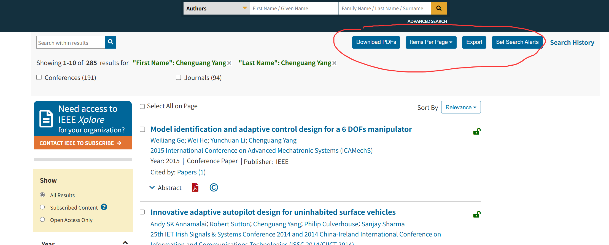

## 📖 Reading & Downloading Articles

---

### **🌐 Online Reading**

Every record offers three main buttons: ==**Abstract**, **HTML**, and **PDF**==.

* Clicking **HTML** opens the full text directly in your browser, so no extra software is needed.

---

### **💻 Standalone Reader**

IEEE does not provide a dedicated reader application. You can either read the **HTML** version online or download the **PDF** and open it with any standard PDF viewer, like Adobe Acrobat Reader.

---

### **📥 Batch Actions & Tools**

From the search results page, you have several options available:

* **Download PDFs**: You can select ==up to **ten**== articles at once. The articles will be compressed into a `.zip` file, which ==cannot exceed 500 MB==.
* **Export**: This allows you to export the first 2,000 records as a `csv` file, save them in various citation formats, or transfer them directly to *Collabrate* or *My Research Projects* (==requires an IEEE personal account==).
* **Set Search Alerts**: Save a query to get notifications when new matching articles are published.
* **Search History**: Lists your previous queries from your current session.
* **Items per Page**: Lets you change how many records appear on each screen.