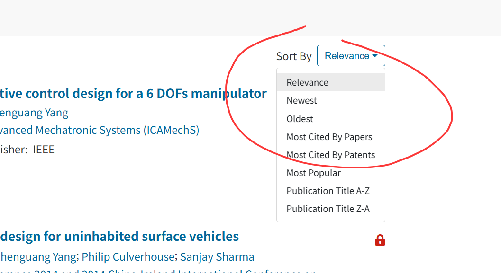
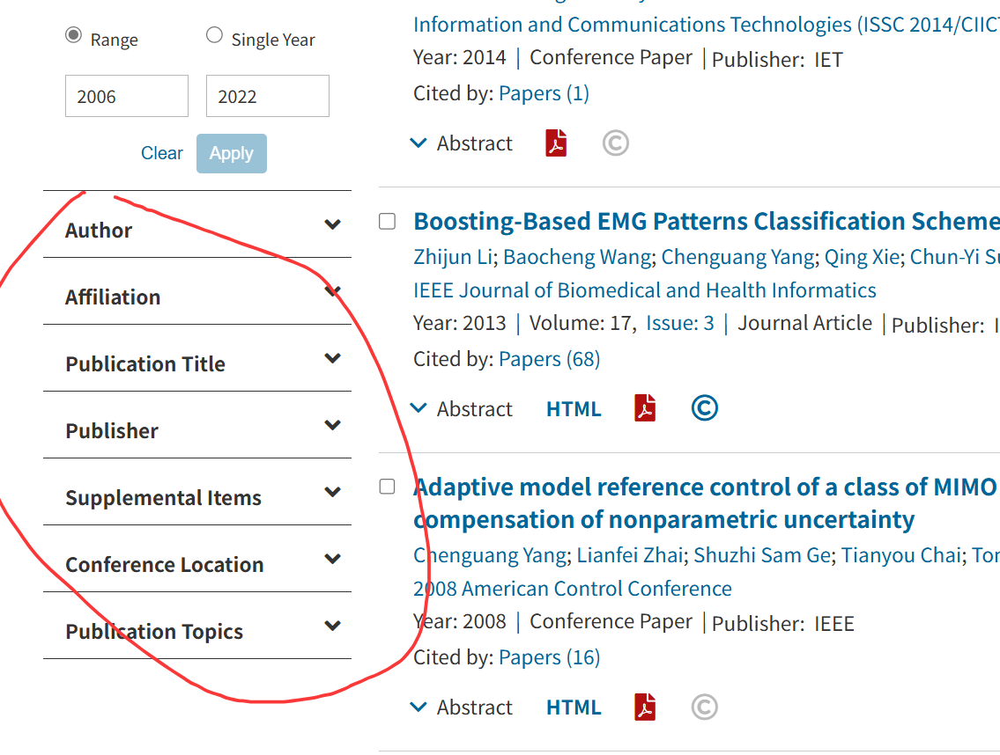
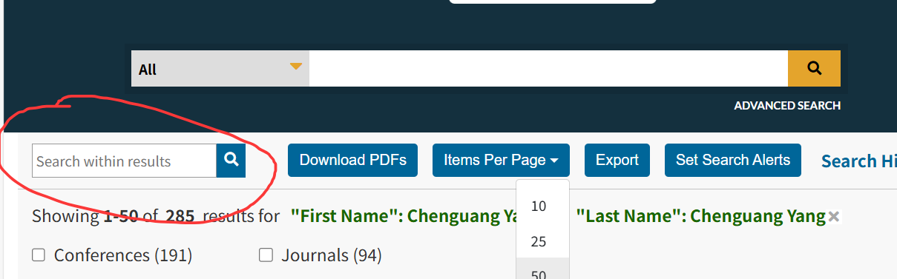

-----
## **🧾Search Methods**
-----
### **1. 🔎 Global Search**

By default, IEEE Xplore searches only the **metadata**. You can limit the search to specific fields using **Boolean expressions**.

**Example:**

```
"Abstract":ofdm AND "Publication Title":communications
```

The platform automatically normalizes British/American spelling, singular/plural forms, and verb tenses, and offers type-ahead keyword suggestions.

**Searchable Fields:**

  * `"Abstract"`
  * `"Publication Title"` (journal or conference title)
  * `"Document Title"` (article title)
  * `"Author"`
  * `"Affiliation"` (author’s institution)
  * `"Standard Number"`
  * `"ISBN"/"ISSN"/"DOI"`

-----

### **2. ⚙️ Advanced Search**

  * **Access:** Click **“Advanced Search”** beneath the main search box.

  ::: tip
   **How to use:**
    * **Fill in the three-line template**: choose ==**“field – operator – search term”**==; add more rows as needed.
    * Supports **“AND / OR / NOT”**; ==parentheses `()` for nesting are **“not”** supported.==
    * Use the options at the bottom of the page to limit publication years.
  :::

-----

### **3. ⌨️ Command Search**

  * **Access point:** **“Command Search”**, located to the right of Advanced Search.
  ::: tip
  * **How to use:** The syntax is identical to the single-box search, but it provides field buttons and respects parenthesis priority, making it ideal for complex strategies.
  :::

**Example:**

```
("Abstract":GAN OR "Keyword":adversarial) AND ("Publication Title":medicine OR "Publication Title":biology)
```

This mode supports `NEAR`/`ONEAR` operators, nested parentheses, and has a query length limit of 40 words.

-----

### **4. 🧑‍🔬 Author Search**

This feature lets you quickly locate papers by a specific author.

  * **Access:** Choose **“Authors”** from the drop-down menu on the left side of the top search box.
  
  ::: warning
  * **Points to remember:**
      * The platform searches all fields and is ==**not case-sensitive**==.
      * **Wildcards** are allowed, but at least three letters must be given in either the first or last name (e.g., `M*ke Jone` is valid; `J*y` is not).
      * Citation downloads display the normalized form: ==surname plus first-name initials==.
      * The selected author name appears at the top of the results; a small **“x”** beside it lets you remove that filter.
      * Use the left-hand facet panel to refine the results further.
  :::

-----

### **5. 📚 Publication Retrieval**

* You can select the **type** of publication you need to find and quickly locate it by searching by keywords.
*	You can search by the **first letter** of the publication or click By Topic to filter a second time by discipline.If you select a discipline type, you can still filter again by the first letter of the publication.
*	You can also refine your search results using the **cluster analysis bar** (Refine results by) on the left side of the page. Sort By and Items Per Page adjust the number of titles displayed per page and the sorting order.
*	You can find the publication you need and directly click on the title to access its journal page (journals and magazines) or abstract (standards, e-books, and online courses).Some journals offer the option to download entire issues.


-----

## 📊 Analyzing Search Results

-----

### **What appears on the results screen?**


Each record shows:

| Record | Explanation |
| :---: | :---: |
| **Paper title** | The document's official title. Can be expanded to show the abstract (a summary of the work). |
| **All authors** | Lists all individuals credited with authorship. Names may link to author-specific detail pages. |
| **Author affiliations** | The organizations (e.g., university, corporation) associated with each author at the time of publication. |
| **Publication title, volume, issue, pages** | Full bibliographic details for the source, including journal/conference title, volume, issue, and page numbers. |
| **Publication or conference date** | The date the document was officially published or presented. |
| **DOI** | Digital Object Identifier (DOI). A unique, persistent link to the online location of the document. |
| **Document-type icon** | A visual icon that identifies the document's publication format (e.g., Journal, Conference Paper, Standard). |
| **Citation counts** | The total number of times the document has been cited by other publications, often separated into paper and patent citations. |
| **Full-text views/downloads** | A usage metric counting the total views and/or downloads of the full-text document. |
| **Access indicator** | An icon (e.g., 🔓) or label ("Open Access") that indicates the full text is available to download without a subscription. |


-----

### **Sorting the results**

Seven sort options are available:

1.  `Relevance` (default)
2.  `Newest First`
3.  `Oldest First`
4.  `Most Cited by Papers`
5.  `Most Cited by Patents`
6.  `Most Popular` (by download/view volume)
7.  `Publication Title A–Z / Z–A`

-----

### **Refining the results**


Use the **left-hand facet panel** for:

  * `Search within results` (secondary search)
  * `Content Type` (journal, conference, standard, etc.)
  * `Publication Year` (drag the year slider)
  * `Author` (only names in the current result set)
  * `Affiliation` (only institutions in the current result set)
  * `Topic / Publisher / IEEE Technical Society`

::: note
==Multiple selections can be combined, and counts refresh instantly.==
::: 
-----

### **Secondary search**


Type a new term in the **“Search within results”** box at the top of the page, or select facets on the left. The query is automatically combined with the previous one using **AND**.

  * For example, after searching for `Java`, entering `XML` in the secondary box is equivalent to searching for `Java AND XML`.
-----

## 🧭 **Search Query**
---

<div class="border border-gray-200 rounded-2xl shadow-md p-6 bg-gradient-to-br from-white via-blue-50 to-indigo-50 leading-relaxed">

### 💾 **Save Search Query**

Saving search queries allows users to conveniently perform searches in the future.  
Each account can save up to **15 search queries**. Additionally, users can enable an **email alert service** — when new results matching the query appear, the platform will send a notification.

::: tip 🌟 **Steps to Create and Save a Search Strategy**
1️⃣ On the **search results interface**, click **"Set Search Alert"** to open the save dialog.  
2️⃣ Enter a name for the search query.  
3️⃣ (Optional) Enable **update alerts**, then click **"Save"** to confirm.  
:::

::: note ✉️ **Notes**
* If you have not set an email address in **Preferences**, an orange prompt will appear:  
  👉 "Set the specified email address according to the prompt."  
* If you didn't enable alerts when saving, go to **"My Settings → Saved Searches"** to reconfigure.  
* Any refinements (e.g., author, publication, year filters) made on the search results page will also be stored in the saved query.  
:::

</div>

---

<div class="border border-gray-200 rounded-2xl shadow-md p-6 bg-gradient-to-br from-white via-indigo-50 to-purple-50 leading-relaxed">

### 📂 **View Saved Search Queries**

Users can browse, delete, or reset their saved search queries.

::: tip 🔍 **How to View Saved Search Queries**
Hover over **"My Settings"** in the navigation bar → click **"Alerts"**.  
The page displays all saved search queries, including:
- **Query Name**
- **Search Terms**
- **Editing Options**
:::

#### ✅ **Available Actions**
* 🔁 Click the **query name** → execute the search.  
* 📰 Click **"RSS"** → get real-time updates and feedback.  
* ✏️ Click **"Edit Name"** → rename or reset update reminders.  
* 🔕 Click **"Disable Alerts"** → stop receiving notifications.  
* 🗑️ Click **"Remove"** → delete the saved search query.

</div>
